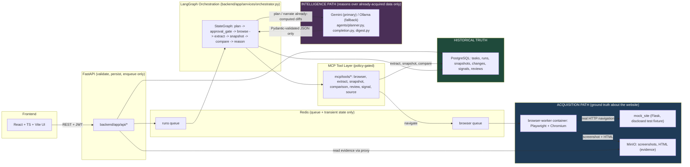
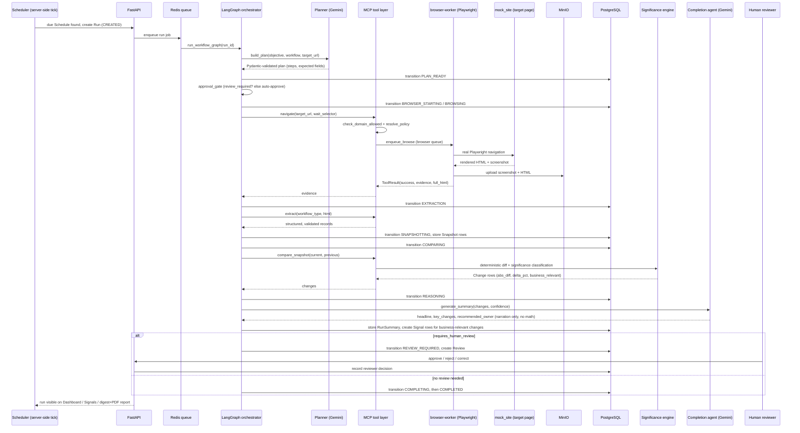
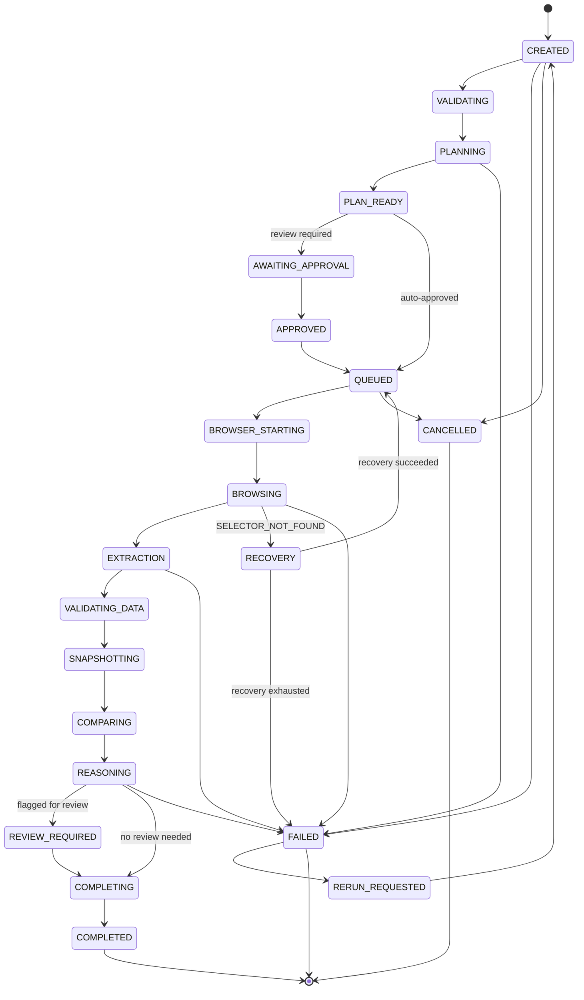

# MakeMyTrip Web Operations Agent

A governed, evidence-backed browser automation platform for monitoring MakeMyTrip-style
travel commerce sources (hotel pricing, competitor offers, campaign pages, partner
updates, travel demand trends). The system runs a real Playwright/Chromium browser
against target pages, extracts structured data deterministically, stores every
observation as evidence, snapshots it in Postgres, compares it against history with
deterministic diff logic, and only then hands the result to an LLM to narrate business
impact. Uncertain or high-impact findings route to a human reviewer before a signal is
considered complete. Nothing in the loop is fabricated: if the browser cannot observe a
page, the system fails visibly and recovers or waits for review, it never substitutes an
LLM guess or a web search for a live observation.

The core loop, enforced end to end:

```
TASK → PLAN → POLICY CHECK → BROWSER EXECUTION → EVIDENCE → EXTRACTION →
VALIDATION → SNAPSHOT → COMPARISON → REASONING → HUMAN REVIEW (if needed) →
SIGNAL → COMPLETION
```

## Capabilities

### Task Intake & Planning
- Operators submit a task (objective, workflow type, target source/page, review policy) through Task Intake.
- The planner (`agents/planner.py`) turns the objective and workflow into a structured, Pydantic-validated browsing plan (target URL, steps, expected fields, stop conditions, risk notes).
- Sensitive workflows pause at `AWAITING_APPROVAL` for a human to approve or reject the plan before any browsing happens.

### Browser Execution & Evidence
- All navigation happens inside a dedicated `browser-worker` container running Playwright against Chromium, never inside the API process.
- Every navigation is policy-checked first: the target domain must be a registered `Source` with a `SourcePolicy` (allowlist, timeouts, rate limits). Unregistered domains are rejected with `POLICY_RESTRICTED`.
- Screenshots and full HTML are captured for every successful navigation and uploaded to MinIO; Postgres stores only the object keys and metadata.
- The Browser Monitor queue (`journey/browse`) shows live run state and captured evidence per run.

### Extraction, Validation & Snapshots
- Deterministic parsers (`extraction/parsers.py`) turn raw HTML into typed records per workflow (hotel, campaign, competitor offer, partner update, trend signal), each Pydantic-validated before persistence.
- Normalization handles currency, dates, availability enums, and whitespace; both the raw and normalized value are kept.
- Each successful run produces a Snapshot row per entity, keyed so later comparisons can be traced back to the exact snapshot they diffed.
- The Extracted Data queue (`journey/data`) shows field-level values, confidence, and evidence references for review.

### Deterministic Comparison & Significance
- `intelligence/comparison/service.py` computes added/removed/modified records and numeric/categorical diffs against the prior snapshot. The LLM never computes a diff or a percentage.
- `intelligence/significance/engine.py` buckets changes into insignificant/minor/notable/significant thresholds and filters out formatting, tracking-param, and unchanged-after-normalization noise so trivial technical noise never becomes a signal.
- The Comparison Feed (`journey/compare`) shows previous vs. current values, delta, and significance per entity.

### AI Reasoning (Gemini-first, Ollama fallback)
- `agents/completion.py` and `agents/digest.py` call the LLM only after deterministic comparison has already run, to narrate already-computed changes into a headline, key changes, recommended owner, and confidence note.
- `agents/llm.py` is a provider-agnostic client: Gemini (`gemini-2.5-flash` / `gemini-2.5-flash-lite`) is primary, Ollama is an optional local/offline fallback, and every call is chosen by `active_provider()` based on which key/URL is configured.
- If no provider is configured or a call fails, the pipeline falls back to deterministic summaries rather than blocking. The AI narrative is a layer on top of the pipeline, never a required link in it.
- Every LLM call is logged as a `ModelInvocation` audit row (node, purpose, provider, model, prompt/output summary, latency, success) visible on the AI Activity page.

### Human Review & Governance
- Runs that produce high-impact or low-confidence findings transition to `REVIEW_REQUIRED` and create a `Review` row instead of auto-completing.
- Reviewers approve, reject, or annotate findings from the Reviews console; every decision is stored with reviewer, action, reason, and timestamp.
- The Plan Review queue (`journey/plan`) gives reviewers the same approve/reject control over a generated plan before it ever reaches the browser.

### Source Health & Self-Healing
- Every `Source` tracks success rate, consecutive failures, and a health state (`HEALTHY`, `DEGRADED`, `UNSTABLE`, `FAILED`, `REVIEW_REQUIRED`) derived only from real Playwright outcomes.
- When a configured selector stops matching, `intelligence/source_health/recovery.py` inspects the page structure (tag/class names, never raw HTML) and tries hardcoded candidate selectors, then an LLM-suggested candidate as a last resort. Every candidate is re-validated by an actual re-navigation before being accepted.
- Recovery attempts are recorded (failure, strategy, result, evidence) and capped at `MAX_RECOVERY_ATTEMPTS`, visible on the Source Health page.

### Signals & Operations Dashboard
- Business-relevant changes become `Signal` rows (type, severity, observations, business impact, confidence, recommendation, owner) traceable back to the Change and Run that produced them.
- The Dashboard and Signals page give an operations-level view across workflows; System Health and Failures pages surface queue/worker/browser health and the error taxonomy (`SOURCE_UNAVAILABLE`, `SELECTOR_NOT_FOUND`, `TIMEOUT`, `POLICY_RESTRICTED`, etc.) per run.

### Ask MMT Assistant (grounded chat)
- `intelligence/chat/retrieval.py` performs deterministic keyword matching against real `Change` and `Signal` rows before any LLM call. A reply is only "grounded" if matching rows were actually found.
- When no relevant monitored data matches the query, the assistant answers from general knowledge and says so explicitly, rather than silently blending general knowledge with live data.

### Scheduling
- The `scheduler` service (`scheduler_service/`) is server-side only, with no frontend timers, ticking every 60 seconds to check for due `Schedule` rows and enqueue real runs through the same pipeline as manually triggered ones.
- The Schedules page manages recurring task cadence; every scheduled run produces the same Run/RunStep/Evidence/Signal chain as an ad hoc run.

### Data Lifecycle
- Run listing is paginated (`limit`/`offset`/`since`) and excludes archived runs by default (`include_archived=true` to see them).
- Archiving a run (single or bulk) sets `archived`/`archived_at`/`archived_by` and hides it from default views without deleting anything, so the full evidence chain stays intact and individually fetchable by ID.
- A retention sweep (`backend/app/services/retention_service.py`) purges only the raw MinIO artifact bytes (screenshot/HTML object keys) older than `RETENTION_DAYS_RAW_ARTIFACTS`; the `Evidence` row itself is never deleted, it is marked `artifact_purged=true` instead, so the chain stays queryable even after the binary is gone.
- Administrators can hard-delete a run, but only after it has been archived first; a live/unarchived run can never be hard-deleted.

### PDF Reporting
- `backend/app/services/report_service.py` renders a run's digest (executive summary, key changes, signals) as a PDF via `GET /api/runs/{run_id}/report.pdf`, built from the same already-computed data as the on-screen digest.

## Architecture



**The one rule that matters most:** Playwright/Chromium is the only source of truth for
what is actually on a page (acquisition). PostgreSQL is historical truth. MinIO holds the
evidence artifacts. LangGraph orchestrates the run. MCP is the controlled tool interface
every node must go through. Gemini/Ollama reason only over data the acquisition path has
already extracted and validated. they never search the web, never invent an
observation, and never compute a diff or percentage. If Playwright fails to acquire data,
the outcome is a visible failure, a bounded self-healing retry, or a review state. never
an LLM-generated answer presented as a live observation. These roles are never reversed.

## Request Flow

Example: a scheduled Hotel Pricing Watch run for a city, end to end.



## Run State Machine

States and transitions exactly as enforced by `backend/app/services/state_machine.py`
and `backend/app/models/run.py`. Every transition persists `previous_state`, `new_state`,
`timestamp`, `reason`, and `actor`.



## MCP Tools

The orchestrator never touches the browser, database writes, or LLM output directly. it
only calls through the policy-checked MCP tool layer in `mcp/tools/`:

- **`browser_tools.py`**. `navigate`: the only path from the orchestrator to Playwright; wraps `browser/executor.py`, enforces the domain allowlist, and returns a `ToolResult` with evidence.
- **`extract_tools.py`**. `extract`: dispatches to the per-workflow deterministic parser (hotel, campaign, competitor, partner, trend) and returns validated records plus a low-confidence count.
- **`snapshot_tools.py`**. `store_evidence_snapshot`, `get_previous_snapshot`: persists and retrieves normalized Snapshot rows keyed by entity.
- **`comparison_tools.py`**. `compare_snapshot`: runs the deterministic comparison + significance classification and persists `Change` rows.
- **`review_tools.py`**. `create_review`: opens a human review record with a trigger reason.
- **`signal_tools.py`**. `create_signal`: persists an operational `Signal` linked back to its `Change` and `Run`.
- **`source_tools.py`**. `check_source_health`: reads a `Source`'s health state and failure counters.

Every tool returns the same `ToolResult` shape (`success`, `data`, `error_type`,
`message`) so the orchestrator's error handling is uniform across all seven categories.

## AI / Deterministic Boundary

- **Gemini-first, Ollama fallback:** `agents/llm.py` picks the active provider (`gemini` if `GEMINI_API_KEY` is set, `ollama` if `OLLAMA_BASE_URL` is set, or none) and exposes one `call_structured()` entry point used by every AI caller. A missing or failing provider raises, and every caller is written to catch that and fall back to deterministic logic rather than block the pipeline.
- **Model routing:** `gemini-2.5-flash-lite` is intended for lighter, high-volume tasks (extraction fallback, classification); `gemini-2.5-flash` handles planning (`agents/planner.py`), completion narration (`agents/completion.py`), signal narration, and run digests (`agents/digest.py`). Both are configurable via `GEMINI_MODEL_LITE` / `GEMINI_MODEL`.
- **AI never computes diffs:** `agents/completion.py` and `agents/digest.py` are given already-computed `ComparisonResult` and `Signal` objects (percent deltas, change types, significance) and are instructed to narrate them, never to recompute or restate numbers as if freshly calculated. The actual math lives in `intelligence/comparison/service.py` and `intelligence/significance/engine.py`.
- **LLM-suggested selectors are never trusted blindly:** `intelligence/source_health/recovery.py` may ask the LLM for one additional candidate selector when hardcoded candidates fail, but the suggestion is only ever a string, and it is re-validated by an actual Playwright re-navigation before being accepted, identically to the hardcoded candidates.
- **Grounded vs. general-knowledge chat:** `intelligence/chat/retrieval.py` performs deterministic keyword matching against real `Change`/`Signal` rows first. Only when matches exist is the LLM told to answer "grounded" in that data; otherwise it answers from general knowledge and the response says so, so a user can never mistake a general-knowledge answer for a live observation.
- **Every LLM call is audited:** `agents/llm.py`'s `call_structured()` records a `ModelInvocation` row per call (node, purpose, provider, model, prompt/output summary, latency, whether a fallback was triggered) regardless of success or failure, visible on the AI Activity page.

## Technology

| Layer | Technology |
| --- | --- |
| Frontend | React 18 + TypeScript + Vite, TanStack Query, React Router, Tailwind CSS, Recharts, Leaflet |
| Backend API | FastAPI, Pydantic, SQLAlchemy 2.0, Alembic, PyJWT |
| Database | PostgreSQL 16 |
| Queue | Redis 7 + RQ (`runs` queue and dedicated `browser` queue) |
| Object storage | MinIO (S3-compatible; screenshots, HTML evidence) |
| Orchestration | LangGraph (`StateGraph`) |
| Tool interface | MCP-style policy-checked tool layer (`mcp/tools`) |
| Browser automation | Playwright + Chromium, isolated in its own `browser-worker` container |
| Extraction | BeautifulSoup4, deterministic parsers/normalizers, Pydantic validation |
| AI | Gemini API (`gemini-2.5-flash`, `gemini-2.5-flash-lite`), Ollama (optional local/offline fallback) |
| Scheduling | APScheduler (`scheduler_service`, server-side, no frontend timers) |
| Reporting | ReportLab (PDF run digests) |
| Test target | Flask `mock_site` (disclosed, self-hosted browsing fixture) |
| Containers | Docker Compose |

## Repository Map

```
makemytrip-web-ops-agent/
├── backend/
│   ├── app/
│   │   ├── api/            REST routers: auth, tasks, plans, runs, reviews, signals,
│   │   │                   sources, schedules, changes, chat, evidence, failures,
│   │   │                   health, model_calls, templates
│   │   ├── auth/            JWT auth, role dependencies
│   │   ├── core/            settings/config
│   │   ├── database/        SQLAlchemy session, MinIO/object storage client
│   │   ├── jobs/             RQ worker entrypoint
│   │   ├── models/           Run, Task, Plan, Snapshot, Change, Signal, Review,
│   │   │                   Source, Failure, User/Role, ModelInvocation, ChatSession
│   │   ├── schemas/          Pydantic request/response contracts
│   │   └── services/         orchestrator, state_machine, run_service, review_service,
│   │                        schedule_service, retention_service, report_service
│   └── migrations/versions/  Alembic migrations (initial schema through chat sessions)
├── agents/                  planner.py, completion.py, digest.py, reasoning_loop.py,
│                            llm.py (provider-agnostic Gemini/Ollama client)
├── intelligence/
│   ├── comparison/           deterministic diff engine
│   ├── significance/         threshold classification + noise filtering
│   ├── snapshots/            snapshot persistence/retrieval
│   ├── source_health/        self-healing selector recovery
│   ├── signals/              historical-context builder for signal narration
│   └── chat/                 grounded-vs-general-knowledge retrieval for the assistant
├── browser/
│   ├── actions/               navigate_and_capture
│   ├── policies/               domain allowlist, rate limits
│   ├── evidence/               screenshot/HTML upload to MinIO
│   ├── sessions/                browser context/session management
│   ├── executor.py            policy check → navigate → evidence, in order
│   ├── jobs.py                  browser RQ queue helpers
│   └── worker.py                 browser-worker entrypoint
├── extraction/               parsers, normalizers, validators, Pydantic schemas
├── mcp/
│   ├── tools/                 browser, extract, snapshot, comparison, review, signal, source
│   └── schemas.py             ToolResult contract
├── mock_site/                 Flask app: disclosed test fixture for all workflows
├── scheduler_service/         server-side recurring-run scheduler (APScheduler)
├── frontend/
│   └── src/
│       ├── pages/              Dashboard, TaskIntake, Runs, RunDetail, Reviews, Signals,
│       │                      Assistant, SourceHealth, Schedules, Failures, SystemHealth,
│       │                      AiActivity, DataManagement, Login
│       │   └── journey/         PlanReviewQueue, BrowserMonitorQueue, ExtractedDataQueue,
│       │                       ComparisonFeed, CompletionQueue (one page per pipeline stage)
│       └── components/         AppLayout, ProtectedRoute
├── scripts/                  run-local.sh (one-command local stack launcher)
├── tests/                     unit, integration, browser, and evidence-authenticity tests
├── deployment/                Dockerfiles (backend, browser-worker)
├── docker-compose.yml
├── requirements-backend.txt
└── requirements-browser.txt
```

## Requirements

- Docker and Docker Compose.
- A Gemini API key for AI planning/reasoning/chat (free tier available at
  [aistudio.google.com/apikey](https://aistudio.google.com/apikey)). The pipeline still
  runs end to end without one. it falls back to deterministic planning and summaries,
  the AI narrative simply won't appear.
- Ollama, optional, as a local/offline alternative to Gemini (set `OLLAMA_BASE_URL`).

## Fast Local Start

```bash
bash scripts/run-local.sh
```

This creates `.env` from `.env.example` if missing, builds and starts the full stack,
waits for API/mock-site/MinIO/frontend health, and seeds demo users. Useful flags:

```bash
bash scripts/run-local.sh --no-build      # start existing images without rebuilding
bash scripts/run-local.sh --logs          # follow service logs after startup
bash scripts/run-local.sh --reset-data    # wipe Postgres/MinIO/Redis volumes first
```

On success it prints:

```
Ops Agent UI (login):    http://localhost:5173
Mock site (demo target): http://localhost:5050
API health:               http://localhost:8000/api/health
API docs:                 http://localhost:8000/docs
MinIO console:            http://localhost:9001
```

Demo accounts (seeded by `backend/seed_users.py`, one per role): `ops@makemytrip.demo`,
`growth@makemytrip.demo`, `reviewer@makemytrip.demo`, `owner@makemytrip.demo`,
`admin@makemytrip.demo` (see that file for the shared demo password).

## Manual Setup

```bash
cp .env.example .env
# set GEMINI_API_KEY in .env (optional but recommended)

docker compose up --build
```

Then run migrations if they have not applied automatically:

```bash
docker compose exec api python -m alembic -c backend/alembic.ini upgrade head
```

## Environment Variables

From `.env.example`:

| Variable | Purpose |
| --- | --- |
| `GEMINI_API_KEY` | Gemini API key; primary LLM provider when set |
| `GEMINI_MODEL_LITE` | Lighter Gemini model for high-volume tasks (default `gemini-2.5-flash-lite`) |
| `GEMINI_MODEL` | Gemini model for planning/reasoning/narration (default `gemini-2.5-flash`) |
| `OLLAMA_BASE_URL` | Optional local/offline Ollama server URL |
| `OLLAMA_MODEL` | Ollama model name, if `OLLAMA_BASE_URL` is set |
| `LLM_PROVIDER` | Force `gemini` or `ollama`; leave blank to auto-detect from the keys above |
| `POSTGRES_USER` / `POSTGRES_PASSWORD` / `POSTGRES_DB` | PostgreSQL credentials/database name |
| `DATABASE_URL` | Full SQLAlchemy connection string |
| `REDIS_URL` | Redis connection string for both queues |
| `MINIO_ENDPOINT` | MinIO host:port |
| `MINIO_ROOT_USER` / `MINIO_ROOT_PASSWORD` | MinIO credentials |
| `MINIO_BUCKET` | Bucket name for evidence artifacts |
| `MINIO_SECURE` | Whether to use TLS against MinIO |
| `MOCK_SITE_BASE_URL` | Base URL of the disclosed test fixture the browser worker navigates |
| `LOG_DIR` | Directory for application logs |
| `RETENTION_DAYS_RAW_ARTIFACTS` | Age in days after which raw MinIO artifacts are purged (Evidence row is kept, only the binary is removed) |
| `CORS_ALLOWED_ORIGINS` | Explicit comma-separated allowed frontend origins (never a wildcard) |

## Development / Testing

```bash
# unit + integration + extraction + evidence-authenticity tests
python -m pytest tests/

# a specific file
python -m pytest tests/test_state_machine.py

# frontend typecheck + build
cd frontend
npx tsc -b
npm run build

# stack lifecycle
docker compose up --build
docker compose logs -f api worker browser-worker
docker compose down
```

## Security

- Every browser navigation is checked against a domain allowlist (`Source` +
  `SourcePolicy` rows) before Playwright is allowed to touch it; unregistered domains are
  rejected as `POLICY_RESTRICTED`.
- Page content is treated as untrusted data, never as instructions. Scraped HTML feeds
  the deterministic parser and, only afterward, structured summaries to the LLM. raw
  page content is never allowed to override system prompts, reveal secrets, trigger
  commands, or redirect the agent to another domain.
- Authentication is JWT-based with a single `role` field per user (`task_creator`,
  `reviewer`, `operations_owner`, `administrator`, `growth_user`, `service_worker`). this
  is role-gated access control, not a full multi-tenant RBAC hierarchy.
- Every significant action (browser execution, extraction, AI reasoning, human review,
  archival, retention purge) writes an `AuditEvent` (actor, action, run/task, result,
  reason, timestamp).
- Secrets (`GEMINI_API_KEY`, database/MinIO credentials) live only in `.env` and
  container environment variables. never in frontend code, logs, prompts, or committed
  files. `.env.example` documents the shape without real values.

## Troubleshooting

- **Gemini call fails or returns 429**: the pipeline logs the failure as a
  `ModelInvocation` with `fallback_triggered=true` and continues with deterministic
  planning/summaries; check `agents/llm.py` logs and confirm `GEMINI_API_KEY` is valid
  and not rate-limited, or configure `OLLAMA_BASE_URL` as a fallback.
- **Containers report unhealthy or the stack won't start**: run
  `docker compose ps` and `docker compose logs -f <service>`; `api`, `worker`, and
  `browser-worker` all depend on `postgres`, `redis`, `minio`, and `mock-site` being
  healthy first.
- **`POLICY_RESTRICTED` on every run**: the target domain has no `Source` +
  `SourcePolicy` row registered; register one before triggering a task against it.
- **Migrations out of date / schema errors**: run
  `docker compose exec api python -m alembic -c backend/alembic.ini upgrade head`.
- **`SELECTOR_NOT_FOUND` repeating without recovery**: check Source Health for the
  domain; recovery is capped at `MAX_RECOVERY_ATTEMPTS`, after which the run moves to
  `FAILED` and the source health state degrades rather than looping forever.
- **Frontend can't reach the API (CORS errors)**: confirm the frontend origin is listed
  in `CORS_ALLOWED_ORIGINS`.
- **Evidence screenshots/HTML missing for an old run**: if the run predates
  `RETENTION_DAYS_RAW_ARTIFACTS`, the raw MinIO object has been purged by the retention
  sweep; the `Evidence` row remains with `artifact_purged=true`, only the binary is gone.
- **Scheduled runs never fire**: confirm the `scheduler` container is running
  (`docker compose up -d scheduler`); it is the only thing that creates runs from
  `Schedule` rows, there are no frontend timers.
